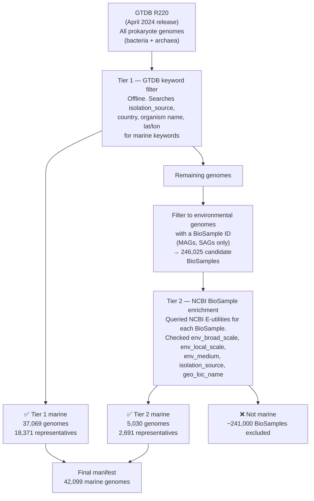
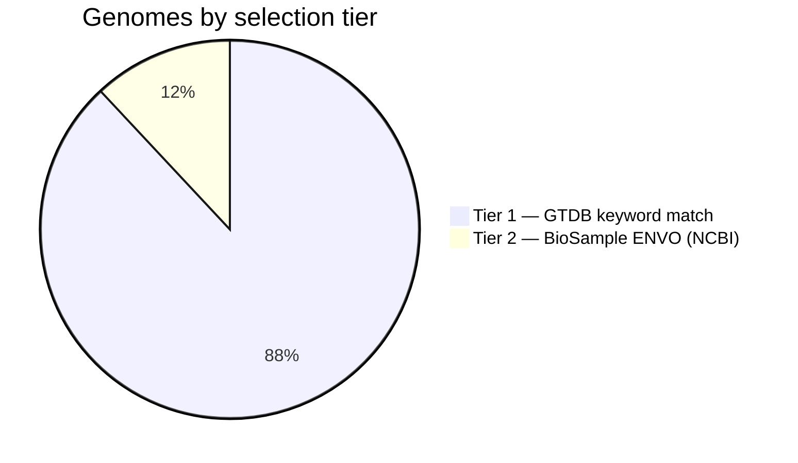
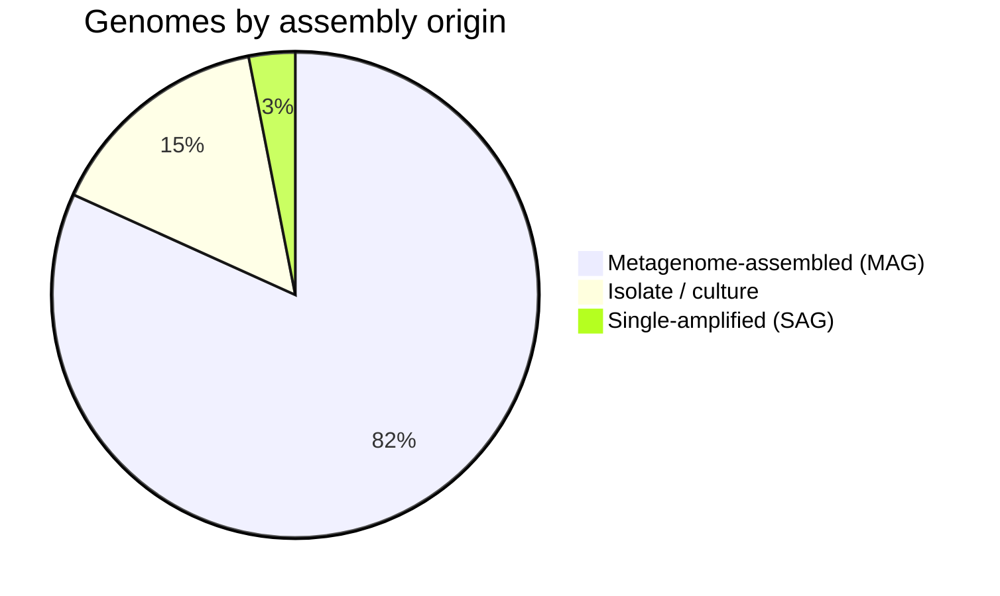

# Marine Genome Selection — What We Downloaded and Why

*A plain-language summary for scientific presentation. For technical details, see `config/config.yaml` and `src/marine_peptides/download/`.*

---

## Overview

We assembled a catalogue of **42,099 marine prokaryote genomes** (bacteria + archaea) to search for novel peptides. Rather than downloading everything and sorting later, we decided upfront which genomes qualify as "marine" and built a provenance manifest before any sequence data was transferred.

**"Marine" in this study includes:**
- Open ocean and coastal seawater
- Marine sediments
- Deep-sea, hydrothermal vents, cold seeps
- Estuaries, intertidal and mangrove zones
- Reef and pelagic environments
- Genomes from host organisms that live exclusively in marine habitats (sponges, corals, marine mammals — *tagged separately, not excluded*)

---

## Source Database

All genomes were drawn from a single, standardised reference:

- **GTDB Release 220** (Genome Taxonomy Database, April 2024) — a curated, de-duplicated catalogue of prokaryote genomes from NCBI, with uniform taxonomy, CheckM2 quality estimates, and assembly metadata.
- **Why GTDB and not raw NCBI?** GTDB applies consistent quality filtering, resolves taxonomic inconsistencies, and designates one representative per species cluster, reducing redundancy before we even start. Every GTDB accession (`GCA_…` / `GCF_…`) is an NCBI accession — GTDB is a curation layer, not a separate sequence repository.

---

## The Problem: "Marine" Is Not a Taxonomy

There is no phylum, class, or kingdom called "marine." Marine origin is recorded in free-text metadata fields (isolation source, sampling location, BioSample environmental attributes) that are:

- **Inconsistently formatted** across submitters (e.g. "seawater", "sea water", "Pacific ocean", ENVO term URIs)
- **Absent entirely** for many MAGs whose environmental context lives only in the original BioSample record at NCBI

This motivated a two-tier approach — matching what GTDB has, then recovering what it doesn't.

---

## Selection Pipeline



---

## Inclusion Criteria

### Tier 1 — GTDB Metadata Keywords

A genome was included in Tier 1 if any of the following fields contained a marine keyword:

- `ncbi_isolation_source`
- `ncbi_country`
- `ncbi_organism_name`
- `ncbi_lat_lon`

**Keywords matched (whole-word, case-insensitive):**

- Core marine terms: *marine, seawater, ocean, oceanic, open ocean*
- Physical environments: *deep sea, abyssal, hadal, bathypelagic, mesopelagic, epipelagic, pelagic, water column*
- Geological/chemical features: *hydrothermal vent, cold seep*
- Coastal/transitional: *coastal, estuary, estuarine, intertidal, tidal flat, mangrove, brackish, lagoon, reef, fjord*
- Geographic descriptors: *Pacific, Atlantic, Indian Ocean, Arctic Ocean, Southern Ocean, Mediterranean Sea, Red Sea, Black Sea, Bering Sea, North Sea, Baltic Sea*
- Named sampling programs: *Tara Oceans*

### Tier 2 — NCBI BioSample Environmental Attributes

Tier 2 targeted MAGs and SAGs that lack GTDB metadata but carry rich environmental records at NCBI (MIxS-standard fields). The same keyword list was applied to:

- `env_broad_scale` (e.g., "marine biome [ENVO:00000447]")
- `env_local_scale` (e.g., "ocean water layer [ENVO:01001067]")
- `env_medium` (e.g., "sea water [ENVO:00002149]")
- `isolation_source`
- `geo_loc_name`

---

## Exclusion Criteria

A genome was excluded if any metadata field contained a known **false-positive or non-marine term**, applied before any inclusion check:

| Exclusion term | Reason |
|---|---|
| *wastewater, sewage, sludge* | Municipal treatment, not marine |
| *freshwater, lake, river, soil, terrestrial* | Non-marine environments |
| *gut, intestin, feces, fecal, oral, skin, wound, clinical, hospital, blood* | Host-associated (human/land animal) |
| *Marine Drive, Marine Parade, Marine Corps* | Geographic names, not habitats |
| *enrichment culture* (without corroborating marine field) | Removed from marine context |

**Host-associated marine genomes** (from sponges, corals, marine fish, marine mammals, marine invertebrates) were **not excluded** — they are tagged with `is_host_associated = True` in the manifest so downstream analyses can include or exclude them as needed.

---

## What Was Not Included


*Note: low-quality genomes are retained in the manifest with their CheckM2 scores so the threshold can be applied at any downstream step. They are not silently discarded.*

---

## Final Dataset Composition

### By Classification Method



- **Tier 1 recovered 37,069 genomes** — marine origin directly visible in GTDB R220 metadata (isolation source, organism name, country, lat/lon).
- **Tier 2 recovered 5,030 additional genomes** — MAGs and SAGs whose habitat was recorded only in NCBI BioSample ENVO fields, invisible to GTDB-only filtering.
- Tier 1's large share relative to Tier 2 reflects the substantially improved metadata coverage in GTDB R220 compared to earlier releases.

### By Genome Type



- MAGs dominate (~82%), reflecting the reality that most marine microbial diversity has never been cultured.
- Isolates (6,383) represent culturable taxa — valuable for validating predictions but a minority.

### By Domain

| Domain | Genomes | GTDB representatives |
|---|---|---|
| Bacteria | 38,328 (91.0%) | 18,371 |
| Archaea | 3,771 (9.0%) | 2,691 |
| **Total** | **42,099** | **21,062** |

### Quality

- **40,061 / 42,099 (95.2%)** pass standard MIMAG thresholds (≥50% completeness, ≤5% contamination)

### Geographic and Environmental Coverage

- **20,989 genomes** have a latitude/longitude coordinate
- **2,789 genomes** have a recorded sampling depth
- **1,408 genomes** are from host-associated marine environments (tagged, not excluded)

---

## Taxonomic Sanity Check

The dominant phyla are exactly those expected for marine prokaryotes, providing confidence that the selection criteria are working correctly. Phylum names follow GTDB R220 nomenclature (which updated several names in this release):

| Phylum (GTDB R220) | Count | Notes |
|---|---|---|
| Pseudomonadota | 17,242 | Formerly Proteobacteria — SAR11, Roseobacter, SAR86; globally dominant marine clades |
| Bacteroidota | 5,286 | Marine particle degraders |
| Actinomycetota | 2,362 | Formerly Actinobacteriota — marine Actinobacteria (OM1 clade) |
| Chloroflexota | 1,716 | SAR202 clade — deep-ocean specialists |
| Cyanobacteriota | 1,332 | Formerly Cyanobacteria — *Prochlorococcus*, *Synechococcus*; major marine phototrophs |
| Desulfobacterota | 1,158 | Sulphate-reducing bacteria abundant in marine sediments |
| Planctomycetota | 1,147 | Associated with marine particles and algal blooms |
| Thermoplasmatota | 1,136 | Marine Group II Archaea — one of the most abundant archaeal lineages in the ocean |
| Thermoproteota | 1,001 | Marine Thaumarchaeota — ammonia-oxidising archaea |
| Verrucomicrobiota | 905 | Marine representatives abundant in coastal/Arctic waters |

---

## A Note on Tier 2 Evidence Strength

Of the 5,030 Tier 2 genomes:

- **4,184 (83%)** have a *strong* environmental signal — a match in `env_broad_scale`, `env_medium`, or `isolation_source` (e.g., "marine biome", "sea water", "hydrothermal vent fluid")
- **78 (2%)** matched only on `geo_loc_name` containing "ocean" (e.g., "Pacific Ocean") — a weaker but still informative signal

The `marine_evidence` column in the manifest records exactly which field and keyword triggered inclusion for every genome, enabling post-hoc precision tuning.

---

## Provenance

All selection decisions are encoded in `config/config.yaml` (keyword lists, thresholds, field names) and are fully reproducible by re-running three ordered scripts against the GTDB R220 metadata files. The manifest itself (`data/processed/genome_manifest.tsv`) is version-controlled and contains per-genome evidence for every inclusion decision.

---

## Tier 3 — Curated Marine Genome Catalogs

### Motivation

Tier 1 and 2 draw exclusively from GTDB R220, which in turn indexes NCBI GenBank/RefSeq assemblies. However, several large-scale marine genomics projects have produced genome collections that either:

- Were published after the GTDB R220 freeze date
- Exist only in non-NCBI repositories (ENA WGS sets, Figshare, CNGB)
- Are MAGs assembled de novo from ocean metagenomes and never submitted to GenBank individually

Tier 3 adds these curated external catalogs to maximize recall for marine prokaryote genomes, regardless of their NCBI indexing status.

### What We Downloaded

| Catalog | Source | Genomes | Disk | Description |
|---------|--------|---------|------|-------------|
| **MarRef** | [Marine Metagenomics Portal](https://mmp.sfb.uit.no/) v1.8 | 137 | 151 MB | Curated complete/near-complete marine reference genomes. All have NCBI GCA accessions. |
| **GORG-Tropics** | ENA project [PRJEB33281](https://www.ebi.ac.uk/ena/browser/view/PRJEB33281) | 12,711 | 2.4 GB | Single-amplified genomes (SAGs) from tropical and subtropical ocean surface waters (Pachiadaki et al. 2019). |
| **MarDB** | [Marine Metagenomics Portal](https://mmp.sfb.uit.no/) v1.7 | 19,761 | 38 GB | Comprehensive marine genome database. All entries have NCBI GCA accessions. Includes MAGs, SAGs, and isolates. |
| **OceanDNA** | [Figshare collection 5564844](https://figshare.com/collections/_/5564844) | 52,325 | 31 GB | ~52k ocean MAGs reconstructed from global ocean metagenomes (Nishimura & Yoshizawa 2022). Species representatives and non-representatives. |
| **GOMC** | [CNGB](https://db.cngb.org/search/project/CNP0001755/) | 0 (failed) | 0 | Global Ocean Microbial Census — 24k + 43k MAGs. Server was persistently unreachable. |
| **Total** | | **84,934** | **~71 GB** | |

### How We Downloaded

#### General approach

- All downloads are **resumable**: scripts track state and skip already-completed files on re-run.
- A **250 GB disk budget** was enforced; downloads halt if projected to exceed it.
- Catalogs were processed in **smallest-first order** (MarRef → GORG → MarDB → OceanDNA → GOMC) to maximize the number of complete catalogs if disk or time ran out.
- **FASTA-only**: we downloaded genomic sequence files only (no annotations, proteins, or supplementary data beyond metadata).
- All files stored under `data/raw/tier3/<catalog>/` with standardized naming.

#### MarRef and MarDB (NCBI-accession-backed catalogs)

1. Parsed the source metadata TSV (`MarRef_1.8.tsv`, `MarDB_1.7.tsv`) to extract NCBI GenBank assembly accessions (`GCA_*`).
2. Checked each accession against existing Tier 1+2 downloads in `data/raw/ncbi_dataset/data/`. Matches were **symlinked** rather than re-downloaded (6,621 MarDB + 16 MarRef = 6,637 total symlinks).
3. Remaining accessions were downloaded from the **NCBI Datasets REST API** (`api.ncbi.nlm.nih.gov/datasets/v2/genome/accession/`) in batches of 100, with 4 parallel workers.
4. Downloaded zip packages were extracted, and genomic FASTA files materialized to the output directory using 8 parallel workers.
5. Accessions that failed to resolve at NCBI were logged to `missing.txt`.

#### GORG-Tropics (ENA WGS sets)

1. Queried the **ENA filereport API** for project PRJEB33281 to obtain the list of all WGS set accessions and their FTP download URLs.
2. Downloaded individual SAG FASTA files from ENA FTP (`ftp.ebi.ac.uk/pub/databases/ena/wgs/public/`) using **12 parallel workers** via `ThreadPoolExecutor`.
3. Files were saved as `<WGS_SET_ID>.fna.gz` (e.g., `CABWXZ01.fna.gz`).

#### OceanDNA (Figshare tarballs)

1. Downloaded three tar archives from Figshare using direct file IDs:
   - `fasta_species-representatives.tar` (29164842) — species representative MAGs
   - `fasta_non-representatives.tar` (29200011) — non-representative MAGs
   - `Supplement_revised.tar.gz` (35080240) — supplementary metadata
2. Verified archive integrity via **MD5 checksums** before extraction.
3. Streamed tar extraction: each member was written as an individual gzipped FASTA (`<OceanDNA-ID>.fna.gz`).
4. Source tar archives were **deleted after extraction** to reclaim disk space.

#### GOMC (CNGB — failed)

1. Attempted to download two large tar archives from `ftp.cngb.org`:
   - `24195.GOMC_genomes.tar.gz` (17.9 GB)
   - `43191.all_MAGs.tar.gz` (30.8 GB)
2. Used a **24-part parallel HTTP Range download** strategy to combat CNGB's extremely slow single-stream throughput.
3. The CNGB server became persistently unreachable (connection refused / SSL EOF errors) before any archive was fully downloaded. **No GOMC genomes were obtained.**

### Overlap with Tier 1+2

Of the 84,934 Tier 3 genomes:

- **6,637 (7.8%)** are also present in the Tier 1+2 manifest (same NCBI accession). These are stored as symlinks to avoid disk duplication.
- **78,297 (92.2%)** are unique to Tier 3 — genomes that were not captured by GTDB keyword filtering or BioSample ENVO queries.

The `is_in_tier12` column in the manifest flags these overlaps for downstream deduplication.

### Metadata Enrichment

| Catalog | GTDB taxonomy | CheckM completeness | Isolation source | Lat/lon | Depth |
|---------|:---:|:---:|:---:|:---:|:---:|
| MarRef | ❌ | ❌ | ✅ (partial) | ✅ (partial) | ❌ |
| GORG | ❌ | ❌ | ✅ ("marine water") | ❌ | ❌ |
| MarDB | ✅ (65%) | ✅ (66%) | ✅ (partial) | ✅ (partial) | ✅ (partial) |
| OceanDNA | ❌ | ❌ | ❌ | ❌ | ❌ |

MarDB provides the richest metadata because its source TSV includes GTDB classification, CheckM QC scores, and sampling location fields. GORG and OceanDNA genomes lack per-genome metadata beyond what is available from their project-level descriptions.

### File Organization

```
data/raw/tier3/
├── marref/       137 files   (GCA_*.fna.gz)
├── gorg/       12,711 files  (<WGS_SET>.fna.gz)
├── mardb/      19,761 files  (GCA_*_genomic.fna or GCA_*.fna.gz)
├── oceandna/   52,325 files  (OceanDNA-*.fna.gz)
└── gomc/            0 files  (download failed)
```

### Manifest

The Tier 3 manifest lives at `data/processed/tier3_manifest.tsv` with columns:

| Column | Description |
|--------|-------------|
| `catalog` | Source catalog name |
| `catalog_id` | Original ID in the source database |
| `ncbi_accession` | NCBI assembly accession (blank for ENA/Figshare-only genomes) |
| `local_path` | Absolute path to the FASTA file on disk |
| `is_symlink` | Whether the file is a symlink to Tier 1+2 data |
| `is_in_tier12` | Whether this genome also appears in the Tier 1+2 manifest |
| `gtdb_taxonomy` | GTDB R220 taxonomy string (where available) |
| `checkm_completeness` | CheckM2 completeness % (where available) |
| `checkm_contamination` | CheckM2 contamination % (where available) |
| `genome_size` | Assembly size in bp |
| `host` | Host organism (if host-associated) |
| `isolation_source` | Sampling environment description |
| `lat_lon` | Geographic coordinates |
| `depth` | Sampling depth in meters |
| `tier3_evidence` | Which catalog/version provided this genome |

### Code

| Script/Module | Role |
|---------------|------|
| `scripts/03_fetch_tier3_metadata.py` | Fetches external metadata, prepares accession lists |
| `scripts/04_download_tier3.py` | Orchestrates phased downloads per catalog |
| `scripts/05_build_tier3_manifest.py` | Scans disk and builds the final manifest TSV |
| `src/marine_peptides/download/tier3/common.py` | Shared utilities (resumable download, tar extraction, disk budget) |
| `src/marine_peptides/download/tier3/marref.py` | NCBI-accession catalog logic (used by both MarRef and MarDB) |
| `src/marine_peptides/download/tier3/gorg.py` | GORG-Tropics ENA download |
| `src/marine_peptides/download/tier3/oceandna.py` | OceanDNA Figshare download + extraction |
| `src/marine_peptides/download/tier3/gomc.py` | GOMC CNGB download (incomplete) |
| `src/marine_peptides/download/tier3/manifest.py` | Manifest assembly helpers |

### Combined Dataset Size

With Tier 3, the project now has access to:

| | Genomes | Unique (deduplicated) |
|---|---|---|
| Tier 1+2 (GTDB R220 marine) | 42,099 | 42,099 |
| Tier 3 (external catalogs) | 84,934 | 78,297 new |
| **Combined** | | **~120,396** |

This represents one of the most comprehensive collections of marine prokaryote genomes assembled for peptide discovery, spanning isolates, MAGs, and SAGs from global ocean sampling campaigns.
