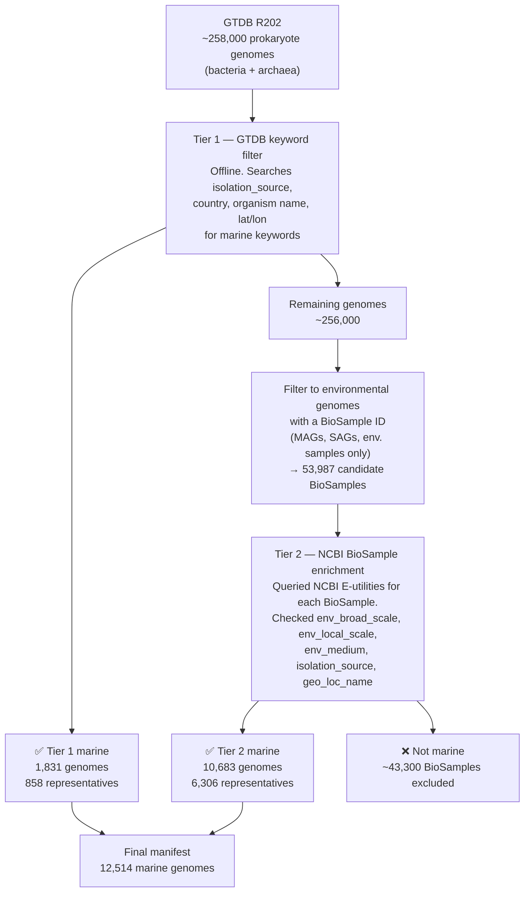
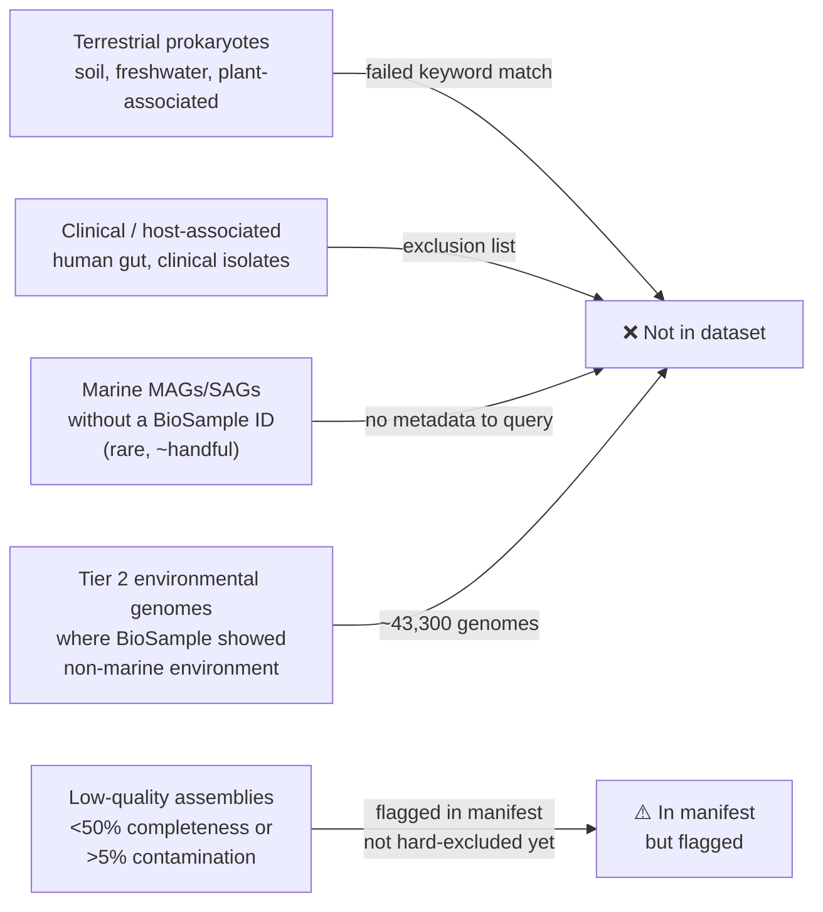
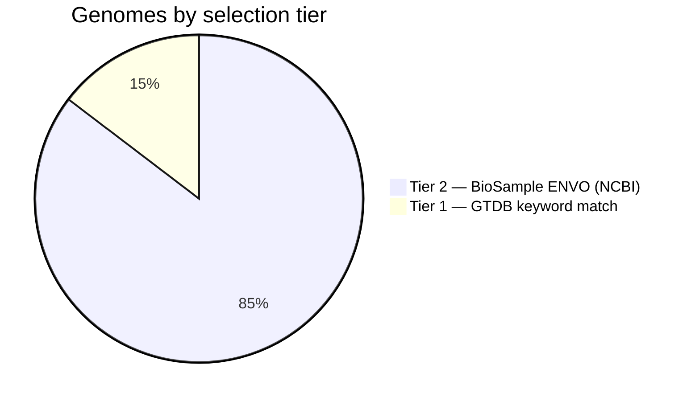
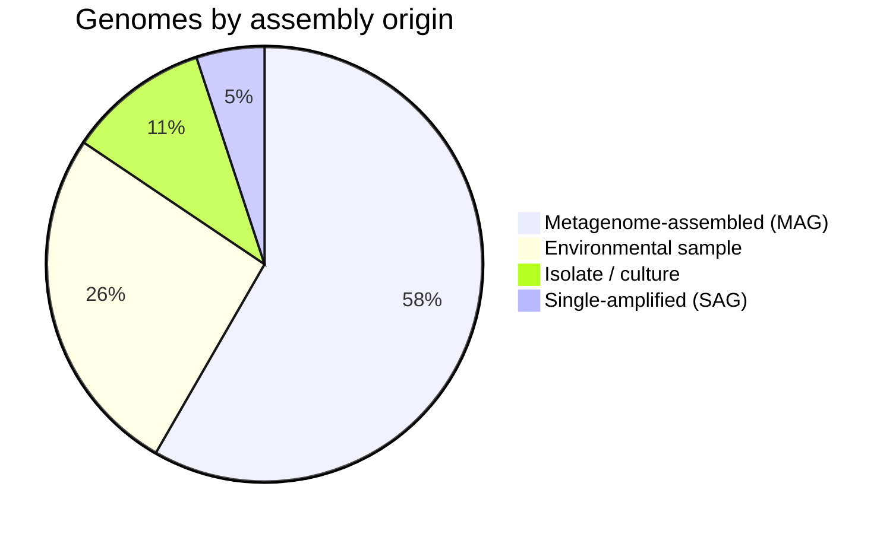

# Marine Genome Selection — What We Downloaded and Why

*A plain-language summary for scientific presentation. For technical details, see `config/config.yaml` and `src/marine_peptides/download/`.*

---

## Overview

We assembled a catalogue of **12,514 marine prokaryote genomes** (bacteria + archaea) to search for novel peptides. Rather than downloading everything and sorting later, we decided upfront which genomes qualify as "marine" and built a provenance manifest before any sequence data was transferred.

**"Marine" in this study includes:**
- Open ocean and coastal seawater
- Marine sediments
- Deep-sea, hydrothermal vents, cold seeps
- Estuaries, intertidal and mangrove zones
- Reef and pelagic environments
- Genomes from host organisms that live exclusively in marine habitats (sponges, corals, marine mammals — *tagged separately, not excluded*)

---

## Source Database

All genomes were drawn from a single, standardised reference:

- **GTDB Release 202** (Genome Taxonomy Database) — a curated, de-duplicated catalogue of ~258,000 prokaryote genomes from NCBI, with uniform taxonomy, CheckM2 quality estimates, and assembly metadata.
- **Why GTDB and not raw NCBI?** GTDB applies consistent quality filtering, resolves taxonomic inconsistencies, and designates one representative per species cluster, reducing redundancy before we even start.

---

## The Problem: "Marine" Is Not a Taxonomy

There is no phylum, class, or kingdom called "marine." Marine origin is recorded in free-text metadata fields (isolation source, sampling location, BioSample environmental attributes) that are:

- **~80% empty** in GTDB's isolation-source column
- **Inconsistently formatted** across submitters (e.g. "seawater", "sea water", "Pacific ocean", ENVO term URIs)
- **Absent entirely** for many MAGs whose environmental context lives only in the original BioSample record at NCBI

This motivated a two-tier approach — matching what GTDB has, then recovering what it doesn't.

---

## Selection Pipeline

---

## Inclusion Criteria

### Tier 1 — GTDB Metadata Keywords

A genome was included in Tier 1 if any of the following fields contained a marine keyword:

- `ncbi_isolation_source`
- `ncbi_country`
- `ncbi_organism_name`
- `ncbi_lat_lon`

**Keywords matched (whole-word, case-insensitive):**

- Core marine terms: *marine, seawater, ocean, oceanic, open ocean*
- Physical environments: *deep sea, abyssal, hadal, bathypelagic, mesopelagic, epipelagic, pelagic, water column*
- Geological/chemical features: *hydrothermal vent, cold seep*
- Coastal/transitional: *coastal, estuary, estuarine, intertidal, tidal flat, mangrove, brackish, lagoon, reef, fjord*
- Geographic descriptors: *Pacific, Atlantic, Indian Ocean, Arctic Ocean, Southern Ocean, Mediterranean Sea, Red Sea, Black Sea, Bering Sea, North Sea, Baltic Sea*
- Named sampling programs: *Tara Oceans*

### Tier 2 — NCBI BioSample Environmental Attributes

Tier 2 targeted the large pool of MAGs and SAGs that lack GTDB metadata but carry rich environmental records at NCBI (MIxS-standard fields). The same keyword list was applied to:

- `env_broad_scale` (e.g., "marine biome [ENVO:00000447]")
- `env_local_scale` (e.g., "ocean water layer [ENVO:01001067]")
- `env_medium` (e.g., "sea water [ENVO:00002149]")
- `isolation_source`
- `geo_loc_name`

---

## Exclusion Criteria

A genome was excluded if any metadata field contained a known **false-positive or non-marine term**, applied before any inclusion check:

| Exclusion term | Reason |
|---|---|
| *wastewater, sewage, sludge* | Municipal treatment, not marine |
| *freshwater, lake, river, soil, terrestrial* | Non-marine environments |
| *gut, intestin, feces, fecal, oral, skin, wound, clinical, hospital, blood* | Host-associated (human/land animal) |
| *Marine Drive, Marine Parade, Marine Corps* | Geographic names, not habitats |
| *enrichment culture* (without corroborating marine field) | Removed from marine context |

**Host-associated marine genomes** (from sponges, corals, marine fish, marine mammals, marine invertebrates) were **not excluded** — they are tagged with `is_host_associated = True` in the manifest so downstream analyses can include or exclude them as needed.

---

## What Was Not Included

*Note: low-quality genomes are retained in the manifest with their CheckM2 scores so the threshold can be applied at any downstream step. They are not silently discarded.*

---

## Final Dataset Composition

### By Classification Method

- **Tier 1 recovered 1,831 genomes** — the "easy" ones whose marine origin was already visible in GTDB metadata (isolation source, organism name, country).
- **Tier 2 recovered 10,683 additional genomes** — MAGs and SAGs whose habitat was recorded only in NCBI BioSample ENVO fields, invisible to GTDB-only filtering. This is the primary reason a two-tier approach was necessary.

### By Genome Type

- MAGs and environmental samples dominate (~84%), reflecting the reality that most marine microbial diversity has never been cultured.
- Isolates (1,314) represent culturable taxa — valuable for validating predictions but a minority.

### By Domain

| Domain | Genomes | GTDB representatives |
|---|---|---|
| Bacteria | 11,462 (91.6%) | 6,373 |
| Archaea | 1,052 (8.4%) | 791 |
| **Total** | **12,514** | **7,164** |

### Quality

- **11,963 / 12,514 (95.6%)** pass standard MIMAG thresholds (≥50% completeness, ≤5% contamination)
- Median CheckM2 completeness: ~83%

### Geographic and Environmental Coverage

- **5,120 genomes** have a latitude/longitude coordinate
- **3,860 genomes** have a recorded sampling depth
- **107 genomes** are from host-associated marine environments (tagged, not excluded)

---

## Taxonomic Sanity Check

The dominant phyla are exactly those expected for marine prokaryotes, providing confidence that the selection criteria are working correctly:

| Phylum | Count | Notes |
|---|---|---|
| Proteobacteria | 5,898 | SAR11, Roseobacter, SAR86 — globally dominant marine clades |
| Bacteroidota | 1,176 | Marine particle degraders |
| Cyanobacteria | 871 | *Prochlorococcus*, *Synechococcus* — major marine phototrophs |
| Actinobacteriota | 644 | Marine Actinobacteria (OM1 clade) |
| Chloroflexota | 496 | SAR202 clade — deep-ocean specialists |
| Thermoplasmatota | 471 | Marine Group II Archaea — one of the most abundant archaeal lineages in the ocean |
| Thermoproteota | 278 | Marine Thaumarchaeota — ammonia-oxidising archaea |
| Planctomycetota | 243 | Associated with marine particles and algal blooms |
| Verrucomicrobiota | 226 | Marine representatives abundant in coastal/Arctic waters |
| Marinisomatota | 179 | Formerly "Marine Group A" — exclusively marine |

---

## A Note on Tier 2 Evidence Strength

Of the 10,683 Tier 2 genomes:

- **9,505 (89%)** have a *strong* environmental signal — a match in `env_broad_scale`, `env_medium`, or `isolation_source` (e.g., "marine biome", "sea water", "hydrothermal vent fluid")
- **1,079 (10%)** matched only on `geo_loc_name` containing "ocean" (e.g., "Pacific Ocean") — a weaker but still informative signal

The `marine_evidence` column in the manifest records exactly which field and keyword triggered inclusion for every genome, enabling post-hoc precision tuning.

---

## Provenance

All selection decisions are encoded in `config/config.yaml` (keyword lists, thresholds, field names) and are fully reproducible by re-running three ordered scripts against the GTDB R202 metadata files. The manifest itself (`data/processed/genome_manifest.tsv`) is version-controlled and contains per-genome evidence for every inclusion decision.
